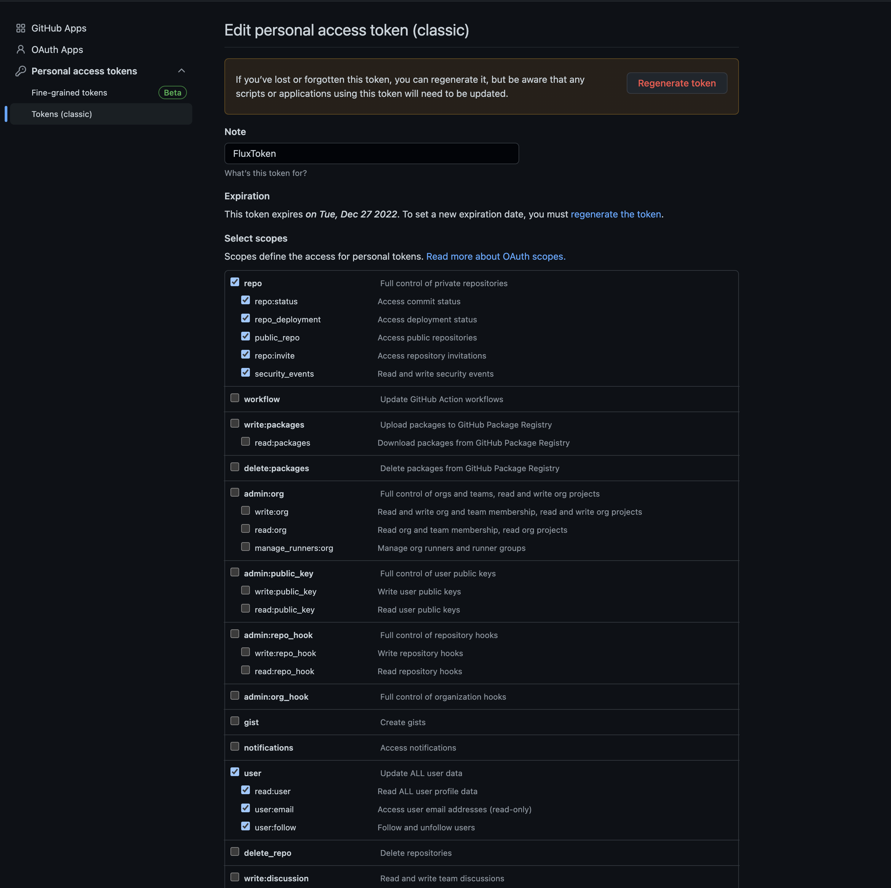
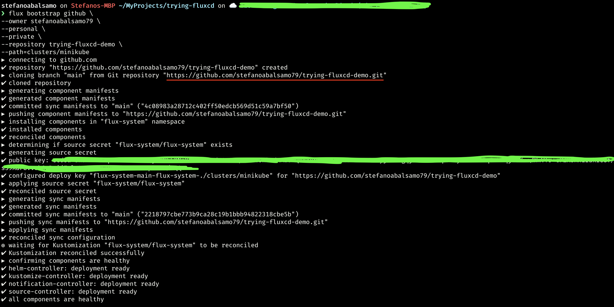
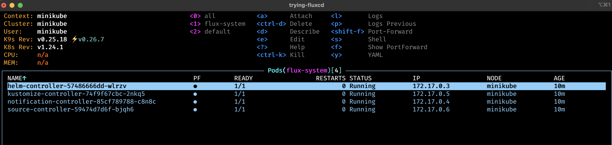
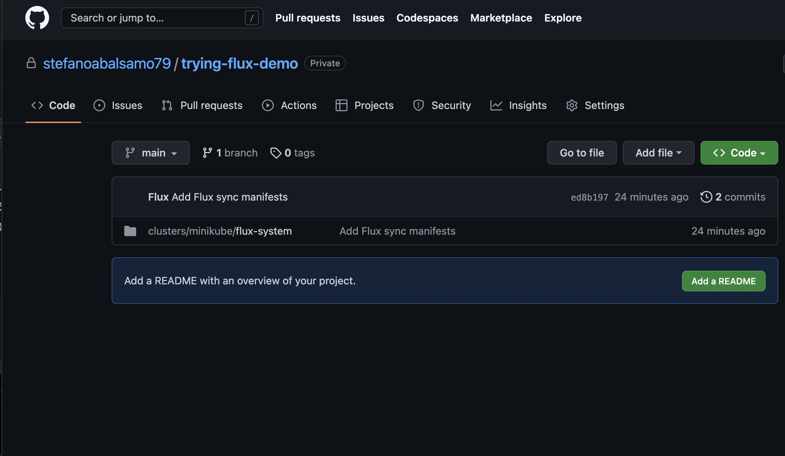
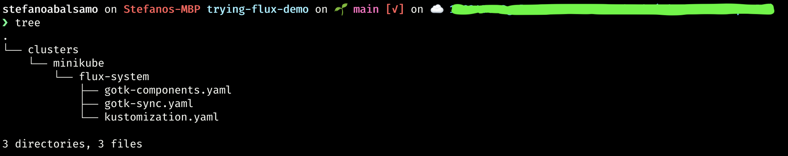

# Trying Flux

Tiny lab for spike purpose about  [`Flux`](https://fluxcd.io/) 

---
***Prerequisites:***
1. [`docker`](https://www.docker.com/): docker daemon for containerization purpose
2. [`kubectl`](https://kubernetes.io/docs/tasks/tools/): docker cli
3. [`kind`](https://kind.sigs.k8s.io/)
4. [`Flux CLI`](https://fluxcd.io/flux/installation/#install-the-flux-cli)
5. [`yq`](https://github.com/mikefarah/yq): [`yaml`](https://en.wikipedia.org/wiki/YAML) parser

---

#### Create a Personal access token on Github. more precisely [`here`](https://github.com/settings/tokens) and for this purpose select `repo` and `user` scope

 

#### Once you have those, export `GITHUB_TOKEN` and `GITHUB_USER` with your own token and github user
```bash
export GITHUB_TOKEN=<your_token>
```

```bash
export GITHUB_USER=<your_username>
```

#### Spin up your kind cluster along with installing the testing application
```bash
make all
```

#### Create a github repository bound to flux via `flux bootstrap` command
```bash
flux bootstrap github \
--owner stefanoabalsamo79 \
--personal \
--private \
--repository trying-fluxcd-demo \
--path=clusters/kind
```

You will see an output like this:


#### After flux bootstrap is done you can see that the demanded [`trying-flux-demo`](https://github.com/stefanoabalsamo79/trying-flux-demo.git) repository has been created along with some controller installed on your cluster
 



#### Clone the repository which have been created and have a look
```bash
git clone https://github.com/stefanoabalsamo79/trying-fluxcd-demo.git
```
You can tell that some CRD have been created to make flux working within the cluster along with `flux-system` namespace and `Kustomization` resource (if you don't know yet have a look [kustomize](https://kustomize.io/)) working with `GitRepository` CRD.



#### So now let's create some resources and place them at `clusters/minikube/test/rbac.yaml` within `trying-flux-demo` repository

```yaml
---
apiVersion: v1
kind: ServiceAccount
metadata:
  labels:
    toolkit.fluxcd.io/tenant: test
  name: test
  namespace: test

---
apiVersion: rbac.authorization.k8s.io/v1
kind: RoleBinding
metadata:
  labels:
    toolkit.fluxcd.io/tenant: test
  name: test-reconciler
  namespace: test
roleRef:
  apiGroup: rbac.authorization.k8s.io
  kind: ClusterRole 
  name: cluster-admin
subjects:
- apiGroup: rbac.authorization.k8s.io
  kind: User
  name: gotk:test:reconciler
- kind: ServiceAccount
  name: test
  namespace: test

```

#### And then push those changes against the repository itself
```bash
git add . &&  \
git commit -m "adding ns, svc acct and rolebinding" &&  \
git push origin main
```

#### Trigger flux reconciliation to prevent from waiting its next run which has been configured as 10 minutes frequency
```bash
flux reconcile ks flux-system --with-source
```

#### Setting you new sources (i.e. git and kustomization sync)
```bash
flux create source git test-flux-app \
--namespace=test \
--url=https://github.com/stefanoabalsamo79/test-flux-app \
--branch=master \
--export > /Users/stefanoabalsamo/MyProjects/trying-fluxcd-demo/clusters/minikube/test/sync.yaml
```
```bash
flux create kustomization test-flux-app \
--namespace=test \
--source=GitRepository/test-flux-app \
--path="./kustomize" \
--export >> /Users/stefanoabalsamo/MyProjects/trying-fluxcd-demo/clusters/minikube/test/sync.yaml
```

***good ones***
```bash
flux create source git trying-fluxcd-app \
--namespace=test \
--url=https://github.com/stefanoabalsamo79/trying-fluxcd \
--branch=master \
--export > /Users/stefanoabalsamo/MyProjects/trying-fluxcd-demo/clusters/kind/test/sync.yaml
```
```bash
flux create kustomization trying-fluxcd-app \
--namespace=test \
--source=GitRepository/trying-fluxcd-app \
--path="./app/kustomize" \
--export >> /Users/stefanoabalsamo/MyProjects/trying-fluxcd-demo/clusters/kind/test/sync.yaml
```

#### Have a look at `clusters/minikube/test/sync.yaml` file you've just created before applying
```yaml


```

#### Before pushing the new resources let's clone the [`test-flux-app`](https://github.com/stefanoabalsamo79/test-flux-app.git), build tag a push the image
```bash
git clone https://github.com/stefanoabalsamo79/test-flux-app.git
```
```bash
make build tag load_image
```

#### Now that you have you new sync let's push them against `test-flux-app` repository
```bash
git add . &&  \
git commit -m "adding GitRepository and Kustomization for test-flux-app sync" && \ 
git push origin main
```

#### Fire flux reconciliation again 
```bash
flux reconcile ks flux-system --with-source
```

#### Test the app
```bash
curl http://localhost:3000/
```
***output:***
```json
{"message":"[1.0.0] Howdy, how is going? All good over here :-)"}
```

#### Now let's make some changes to `test-flux-app` deployment, TEST_VAR env variable for instance in order to tell that the app replies with a difference payload
```yaml
apiVersion: apps/v1
kind: Deployment
metadata:
  name: test-flux-app-deployment
...
spec:
  ...
  template:
    ...
    spec:
      ...
          env:
          - name: TEST_VAR
            value: 1.0.1
```


```bash
git add . &&  \
git commit -m "changing TEST_VAR variable for test-flux-app" && \ 
git push origin master
```

#### Fire flux reconciliation again 
```bash
flux reconcile ks flux-system --with-source
```

#### Test the app again
```bash
curl http://localhost:3000/
```
***output:***
```json
{"message":"[1.0.1] Howdy, how is going? All good over here :-)"}
```

#### get sources
```bash
flux get source git -A
```

```bash
flux get ks -A
```


